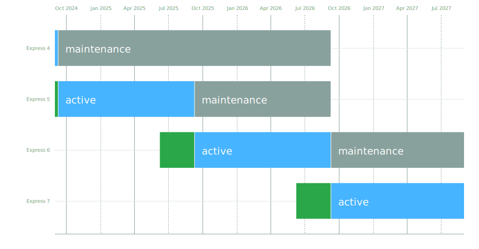

# Express Release Strategy

## Major Version Releases

* Major versions are released when breaking changes are required.
* A new major version will be released a minimum of 12 months after the last major version release.

## Version Lifecycle

* **PRE-RELEASE:** A new major version is designated as PRE-RELEASE upon release of an alpha, beta, or rc version (e.g. `6.0.0-beta.0`). It is available as the `next` version on npm for a minimum of three months.
* **ACTIVE:** After the minimum three-month period, the ACTIVE version is released (e.g. `6.0.0`) and is the `latest` version on npm for a minimum of 12 months.
* **MAINTENANCE:** When a new major version becomes ACTIVE, the previous major version enters MAINTENANCE. The MAINTENANCE period lasts for 12 months.

## Generate the SVG

```sh
npx lts --start 2024-09-01 --end 2027-09-01 -d "$PWD/schedule.json" -m -n Express -g "$PWD/schedule.svg"

npx svgo "$PWD/schedule.svg"
```

### or generate a PNG

```sh
npx lts --start 2024-09-01 --end 2027-09-01 -d "$PWD/schedule.json" -m -n Express -p "$PWD/schedule.png"
```


